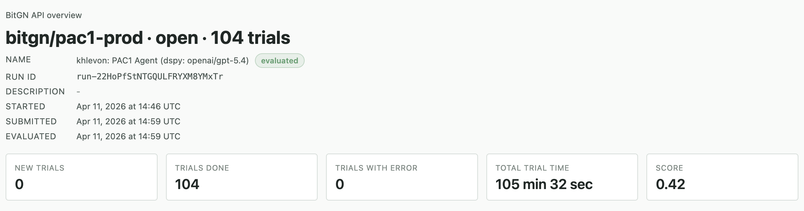

# PAC1 Challenge

DSPy ReAct agent for the **BitGN PAC1** benchmark. The agent operates inside a sandboxed PCM filesystem VM through a small set of tools (`tree`, `list_dir`, `read`, `write`, `delete`, `mkdir`, `move`, `find`, `search`, `context`) and emits a structured outcome (`OUTCOME_OK`, `OUTCOME_DENIED_SECURITY`, `OUTCOME_NONE_CLARIFICATION`, `OUTCOME_NONE_UNSUPPORTED`, `OUTCOME_ERR_INTERNAL`) plus a summary and file refs for each task.

## Results

Scored **0.42 (42%)** on `bitgn/pac1-prod` — 104 trials, 0 errors, ~105 min wall time.



## Architecture

```text
src/
├── main.py       # entrypoint: run all (or filtered) benchmark tasks
├── optimize.py   # entrypoint: BootstrapFewShot → MIPROv2 → save state
├── agent.py      # PAC1Signature + PAC1Agent (dspy.ReAct wrapper)
├── harness.py    # BitGN client, trial lifecycle, parallel batching (size 8)
├── tools.py      # PCM runtime tools (filesystem ops bound to a vm client)
├── lm.py         # DSPy LM factory (run vs optimize models)
└── config.py     # .env loader, typed settings
```

**Two-model split** (defaults from `.env.template`):

- `RUN_MODEL_ID=openai/gpt-5.4` via OpenRouter (`RUN_MODEL_API_BASE=https://openrouter.ai/api/v1`). Runs every task; this is what gets optimized. Any OpenAI-compatible endpoint works — use the `openai/` prefix.
- `OPTIMIZE_MODEL_ID=anthropic/claude-sonnet-4-6`. Teacher in `BootstrapFewShot` and `prompt_model` in `MIPROv2`. Only used during `optimize`.

Optimized prompts are saved to `OPTIMIZED_AGENT_PATH` (default `optimized_agent.json`) and auto-loaded on the next `run`.

**Trial loop** (`harness.run_trial`): take a fresh `PcmRuntimeClientSync`, rebind tools to it via `agent.update_tools`, build a grounding snapshot (tree + `AGENTS.md` + UTC date context), call ReAct, then `vm.answer(...)` with the predicted outcome/summary/refs.

## Setup

1. Requires Python ≥ 3.14 and [`uv`](https://docs.astral.sh/uv/).
2. Copy `.env.template` → `.env` and fill in:
   - `BITGN_API_KEY` — BitGN benchmark key
   - `RUN_MODEL_API_KEY` — OpenRouter key (or any OpenAI-compatible endpoint paired with `RUN_MODEL_API_BASE`)
   - `ANTHROPIC_API_KEY` — only needed for `optimize`
   - `BENCHMARK_ID` — `bitgn/pac1-dev` for optimization, `bitgn/pac1-prod` for final scoring
3. Install deps:

   ```bash
   make sync
   ```

## Playbook

> **Always optimize on `bitgn/pac1-dev`, never on prod.** MIPROv2 needs many trial calls and would leak signal from the held-out prod set. Switch `BENCHMARK_ID` to `bitgn/pac1-prod` only for the final `make run`.

```bash
# install / refresh deps
make sync

# 1. optimize on DEV (set BENCHMARK_ID=bitgn/pac1-dev in .env) → writes optimized_agent.json
make optimize

# optionally, optimize on a subset of dev tasks
make optimize-task TASKS='t01 t02 t03'

# 2. score on PROD (set BENCHMARK_ID=bitgn/pac1-prod in .env)
make run

# run a subset of tasks
make run-task TASKS='t01 t03'
```

Typical flow: `make sync` → `make optimize` (dev) → flip `BENCHMARK_ID` to prod → `make run`.

To start fresh (ignore saved prompts), delete `optimized_agent.json` before `make run`.
